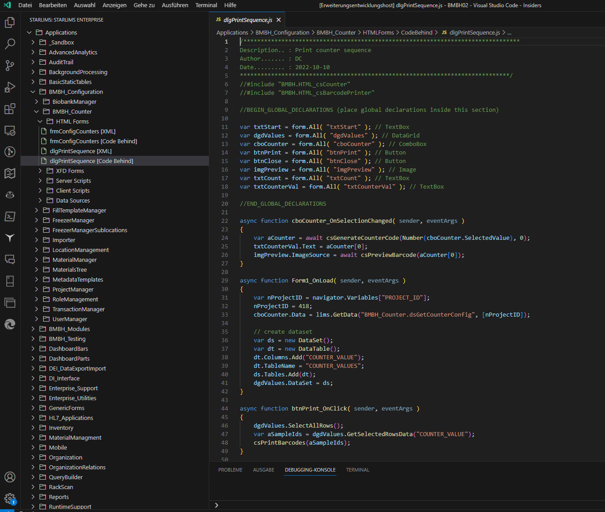

# STARLIMS VS Code

Extension provides Visual Studio Code integration with STARLIMS Enterprise Designer. Started as a fun project to brush up on Typescript and learn the Visual Studio Code extensibility API. At this moment the extension is not published in the VS Marketplace as I'm continuing to add new features that will bring it closer to offering some actual value.



# Authors

- [Marius Popovici](https://github.com/mariuspopovici)
- [Christoph Döllinger](https://github.com/MrDoe/)
- [Jan Bouecke](https://github.com/jbouecke/)

## Pre-requisites

- Download STARLIMS .sdp package attached to [current release](https://github.com/mariuspopovici/starlimsvscode/releases).
- Import .sdp package into STARLIMS Designer.
- Add the following setting to STARLIMS web.config file

```
<add key="HTTPServices" value="SCM_API.*"/>
```

## Disclaimer

This is an unofficial, unsupported extension so use at your own risk. Maybe this will someday become officially supported or maybe not...

## Vision
- Implement a Git-like mechanism for managing versions.
- Design HTML forms directly in VS Code via a HTML preview window.
- Implement more features from Starlims Designer

## Features

Features:

- Explore Enterprise Designer (Applications, Data Sources, Server Scripts and Client Scripts)
- Check out STARLIMS code items to a local folder
- Edit local copies and compare changes with remote version
- Check in changes to a server
- Open forms in browser (Chrome or Edge) and debug them in VS Code
- Execute remote scripts and view execution return values
- Execute data sources and render data source execution results in a grid view
- View and clear user logs
- Launch XFD forms via the STARLIMS bridge
- Syntax color theme and highlighting for SSL and SSL SQL data sources

To Do:

- Show all checked out items
- Move forms and scripts
- Edit form resources
- Global find function
- Create a HTML form designer
- Implement table support including a schema and ERD generator / viewer

## Extension Settings

This extension contributes the following settings:

- `STARLIMS.url`: URL to Starlims installation (e. g. http://starlimsdev/STARLIMS11.STARLIMS.DEV/)
- `STARLIMS.user`: User for STARLIMS authentication
- `STARLIMS.password`: User password STARLIMS authentication
- `STARLIMS.browser`: Browser for debugging forms (only Chrome or Edge supported)
- `STARLIMS.rootPath`: Path for storing temporary files (downloaded forms and scripts)

## How to Use

- Download extension files attached to [current release](https://github.com/mariuspopovici/starlimsvscode/releases).
- (Install VSIX file, Import SCM_API.sdp package into STARLIMS)
- Add a local folder to the current VS Code workspace. This will serve as your local STARLIMS code repository.
- Activate extension clicking the STARLIMS logo in the VS Code sidebar.
- Configure extension settings (STARLIMS url, user and password, root folder). You will be prompted to set these upon attempting to activate the extension for the first time. The root folder should be set as the path to the folder selected in the previous step.
- Configure VS Code Color Theme and activate the **SSL Language Theme (Dark)** theme.

## Known Issues

- Please let us know under "Issues"

## Release Notes

### 1.0.0

Initial release of STARLIMS VS Code

## 1.1.0

Resurrected this project. Updated dependencies including the new VS Code API.
Replaced request-promise with node-fetch.
Implemented a TextDocumentContentProvider for viewing STARLIMS code and refactored API to implement a URI based approach for referencing code items.

## 1.1.1

- Bug fixes
- Added Get Local Version to remote version editor window context menu
- Activation of extension when executing a compare command
- Showing remote checkout status in explorer tree

## 1.2.x

New features:

- Automatically export items to local workspace
- Check in/out items
- View/clear user logs
- Add/delete new items and categories
- Search for items
- Run HTML forms in browser
- Run XFD form (requires STARLIMS Bridge)
- Integrated SSL-Lang theme
- Debug HTML forms directly in VS Code
- Run data sources and server scripts
- Support for exploring database and dictionary including tree commands for generating INSERT, DELETE, SELECT and UPDATE statements for the selected table.
- Misc. bug fixes
- Go to script/form under the cursor
