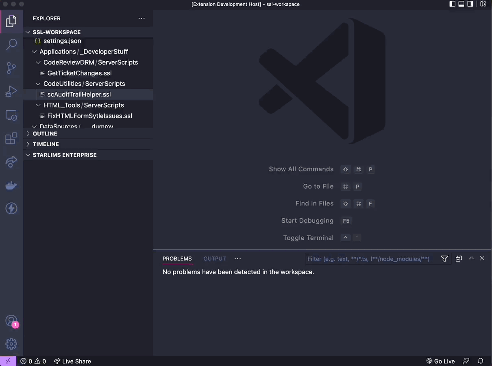

# STARLIMS VS Code

Extension provides Visual Studio Code integration with STARLIMS Enterprise Designer. Started as a fun project to brush up on Typescript and learn the Visual Studio Code extensibility API. At this moment the extension is not published in the VS Marketplace as I'm continuing to add new features that will bring it closer to offering some actual value.

I recommend using this in conjunction with the [ssl-lang](https://marketplace.visualstudio.com/items?itemName=Janosch.ssl-lang) extension which provides syntax highlighting support for STARLIMS Scripting Language.

## Pre-requisites

Requires a server side API which I will make available once the functionality becomes stable enough.

## Disclaimer

This is an unofficial, unsupported extension so use at your own risk. Maybe this will someday become officially supported or maybe not...

## Vision

Implement a Git-like mechanism for managing versions. Extension can be used to explore the remote tree and download code to a local repo.
Changes can be pushed back to the STARLIMS dictionary and merged with the remote version.

## Features

Features:

- Explore Enterprise Designer (Applications, Data Sources, Server Scripts and Client Scripts).
- Download copies of STARLIMS code items to a local folder.
- Edit local copies and compare changes with remote version
- Execute remote scripts and view execution return values.

TODO:

- Check-in / Check-out items - Merge local changes with remote
- Others

## Extension Settings

This extension contributes the following settings:

- `STARLIMS.url`: URL to starlims installation (e.g. http://starlimsdev/STARLIMS11.STARLIMS.DEV/)
- `STARLIMS.user`: user for STARLIMS authentication
- `STARLIMS.password`: user password STARLIMS authentication

## How to Use

- Install extension
- Configure extension settings (STARLIMS url, user and password)
- Activate extension using the _STARLIMS Connect_ command (press F1).

## Known Issues

N/A

## Release Notes

### 1.0.0

Initial release of STARLIMS VS Code

---

## 1.1.0

Resurrected this project. Updated dependencies including the new VS Code API.
Replaced request-promise with node-fetch.
Implemented a TextDocumentContentProvider for viewing STARLIMS code and refactored API to implement a URI based approach for referencing code items.

## 1.1.1

Bug fixes.
Added Get Local Version to remote version editor window context menu
Activation of extension when executing a compare command
Showing remote checkout status in explorer tree
